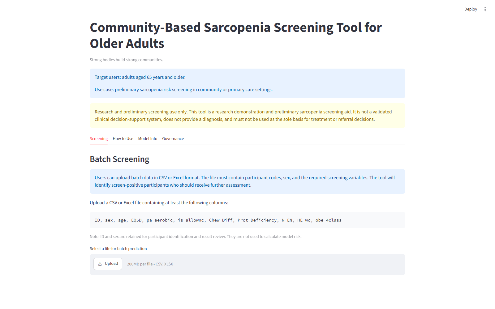
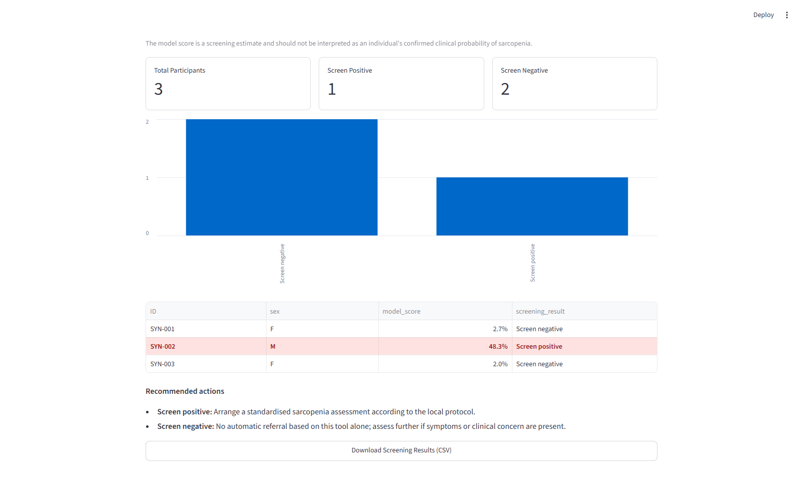
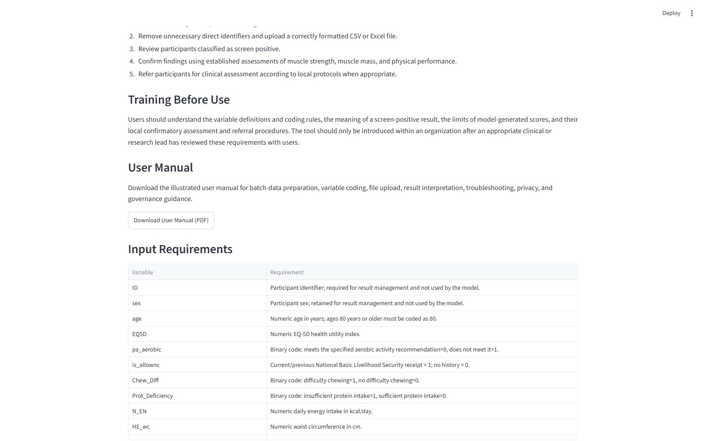
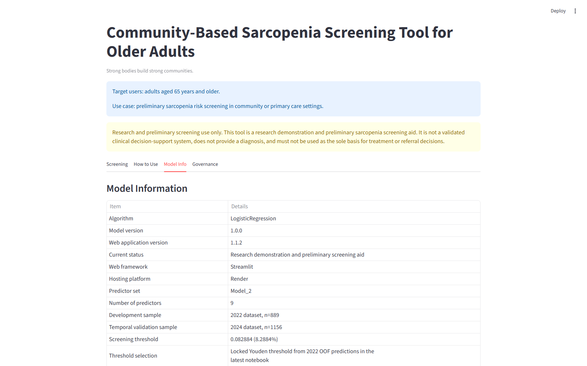
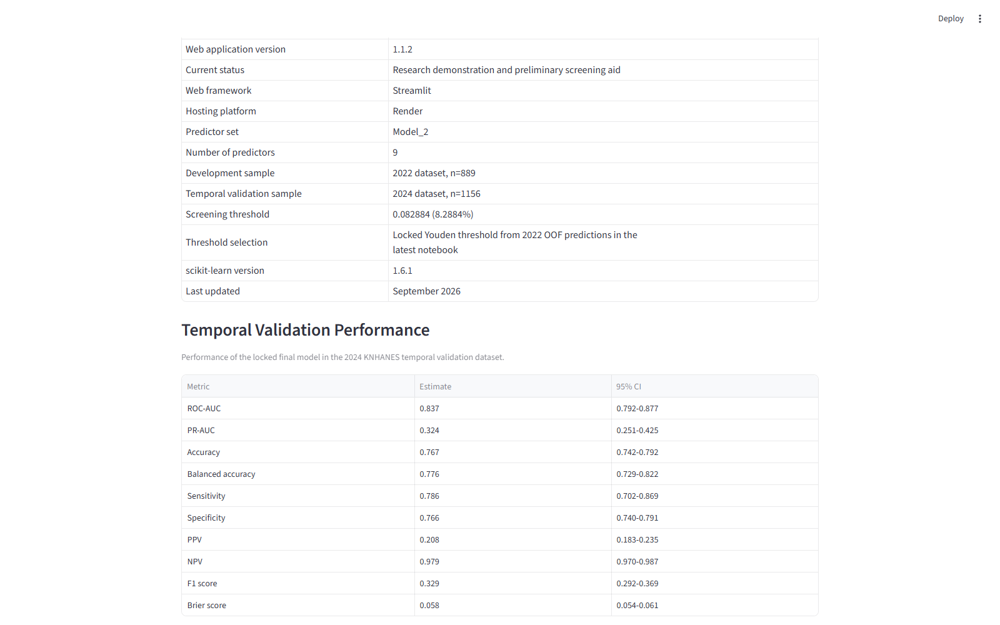
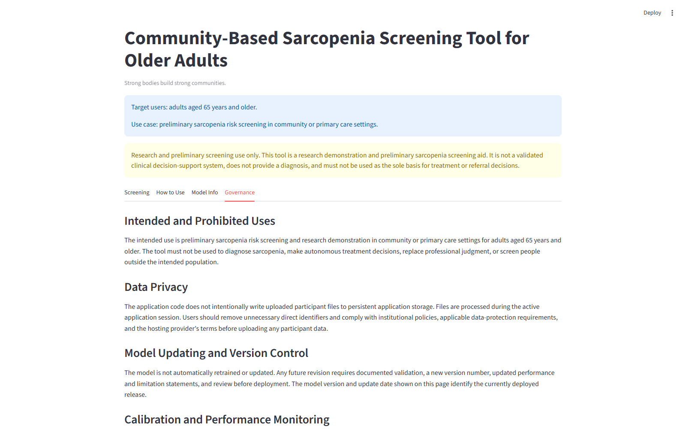

# User Guide

## Community-Based Sarcopenia Screening Tool for Older Adults

**Document version:** 1.0  
**Web application version:** 1.1.2<br>
**Locked model version:** 1.0.0  
**Last updated:** September 2026

## 1. Purpose and scope

This guide explains how trained community-health, primary-care, and research personnel can prepare batch data, run the web-based screening tool, interpret the output, and manage the results safely.

The tool is intended for preliminary sarcopenia risk screening among adults aged 65 years and older. It is a research demonstration and screening aid, not a diagnostic system or a substitute for clinical judgement. A screen-positive result requires a standardised sarcopenia assessment according to the applicable local protocol.



## 2. Before use

Users should:

1. Understand the variable definitions and coding rules in Section 4.
2. Understand the difference between screening and diagnosis.
3. Know the local procedures for confirmatory assessment and referral.
4. Remove unnecessary direct identifiers before uploading data.
5. Confirm that institutional policy permits use of the selected hosting environment.

The current release supports batch screening only. Users can upload batch data in CSV or Excel format.

Supported formats:

- CSV (`.csv`)
- Excel Workbook (`.xlsx`)

Legacy Excel `.xls` files are not supported and should be saved as `.xlsx` or `.csv` before upload.

## 3. Quick-start workflow

1. Download the CSV input template from the **How to Use** tab or use `examples/sample_input.csv`.
2. Download the illustrated PDF manual from **How to Use > User Manual** when an offline copy is required.
3. Enter one participant per row and retain the required column names exactly.
4. Confirm that all participants are aged 65 years or older and code ages 80 years or older as 80.
5. Confirm that categorical values use the required numeric codes.
6. Open the **Screening** tab and upload the `.csv` or `.xlsx` file.
7. Review warnings or errors. Correct the source file and upload it again when an error is displayed.
8. Review the screening summary and participant-level results.
9. Download the result CSV and store it according to institutional policy.
10. Arrange standardised assessment for screen-positive participants according to the local protocol.

## 4. Required input data

The uploaded file must contain the following columns. Column names are case-sensitive and should not be renamed.

| Column | Definition and permitted coding |
|---|---|
| `ID` | Non-identifying participant code. Required for result management; not used by the model. |
| `sex` | Participant sex. Retained for result management; not used by the model. |
| `age` | Numeric age in years; ages 80 years or older must be coded as 80. |
| `EQ5D` | Numeric EQ-5D health utility index. |
| `pa_aerobic` | Meets the specified aerobic activity recommendation = 0; does not meet it = 1. |
| `is_allownc` | Current/previous National Basic Livelihood Security receipt = 1; no history = 0. |
| `Chew_Diff` | Difficulty chewing = 1; no difficulty chewing = 0. |
| `Prot_Deficiency` | Protein intake is insufficient = 1; sufficient = 0. Insufficient means below 60 g/day for men and below 50 g/day for women. |
| `N_EN` | Numeric daily energy intake in kcal/day. |
| `HE_wc` | Numeric waist circumference in cm. |
| `obe_4class` | Normal weight = 0; underweight = 1; overweight = 2; obesity = 3. |

Weight-status categories use the following BMI definitions:

- Normal weight: 18.5 to less than 23 kg/m²
- Underweight: less than 18.5 kg/m²
- Overweight: 23 to less than 25 kg/m²
- Obesity: 25 kg/m² or greater

Important: numeric codes must match those used in the model-development data. Do not replace `0`, `1`, `2`, or `3` with free-text labels.

## 5. Uploading and validating a file

Open the **Screening** tab and choose **Select a file for batch prediction**. Processing begins after a supported file is selected.

The application checks:

- whether all required columns are present;
- whether model inputs are numeric;
- whether age is present and between 65 and 80 after coding ages 80 years or older as 80;
- whether binary fields contain only 0 or 1;
- whether `obe_4class` contains only 0, 1, 2, or 3;
- whether participant identifiers are missing or duplicated; and
- whether non-age model inputs contain missing values.

Invalid data produce an error and no prediction is generated. Missing non-age model inputs produce a warning and are imputed by the locked preprocessing pipeline. Users should investigate missingness rather than treating imputation as a substitute for data-quality review.

## 6. Reviewing and downloading results

The results page presents the number screened, the numbers classified as screen positive and screen negative, the positivity rate, a summary chart, and a participant-level table.



The downloaded CSV retains the original input fields and adds:

| Output field | Meaning |
|---|---|
| `model_score` | Model-generated screening score. It is not a confirmed individual clinical probability. |
| `screening_result` | `Screen positive` or `Screen negative`, determined using the locked threshold. |
| `recommended_action` | Standardised next-step guidance associated with the screening classification. |

Recommended actions:

- **Screen positive:** Arrange a standardised sarcopenia assessment according to the local protocol.
- **Screen negative:** No automatic referral based on this tool alone; assess further if symptoms or clinical concern are present.

Do not interpret a screen-positive result as a diagnosis. Do not interpret a screen-negative result as proof that sarcopenia is absent.

## 7. On-screen guidance

The **How to Use** tab describes the recommended workflow, training requirements, input requirements, and interpretation principles. It provides both a downloadable PDF user manual and a CSV input template.



## 8. Model and application information

The model and web application are versioned separately:

- Locked model version: `1.0.0`
- Web application version: `1.1.2`

Changes to the interface, documentation, or software-validation evidence do not imply that the locked model was retrained.



The **Model Info** tab reports temporal validation using 2024 KNHANES data (`n = 1,156`). These estimates describe performance in the reported validation sample and do not guarantee equivalent performance in another population or setting.



## 9. Governance, privacy, and prohibited uses

The application code does not intentionally write uploaded participant files to persistent application storage. Files are processed during the active application session. Nevertheless, users must assess the complete operational environment, including browser, network, hosting provider, access controls, downloads, and local storage.

Users should:

- use non-identifying participant codes;
- remove unnecessary direct identifiers;
- restrict access to input and output files;
- follow applicable institutional and data-protection requirements; and
- retain or delete downloaded results according to an approved data-management plan.

The tool must not be used to diagnose sarcopenia, make autonomous treatment decisions, replace professional judgement, or screen people outside the intended population.



## 10. Troubleshooting

| Message or problem | Recommended response |
|---|---|
| Unsupported file type | Save the file as `.csv` or `.xlsx` and upload it again. |
| Missing required columns | Restore the exact required column names and check spelling and capitalisation. |
| Non-numeric values | Replace text in model-input fields with valid numeric values or codes. |
| Participant younger than 65 years | Remove the record; the model is restricted to adults aged 65 years and older. |
| Age above 80 | Code ages 80 years or older as 80 and upload the file again. |
| Invalid binary code | Use only 0 or 1 according to the definition for that variable. |
| Invalid weight-status code | Use only 0, 1, 2, or 3 according to the defined BMI categories. |
| Missing model inputs warning | Verify the source data. If the missing values are retained, document that locked-pipeline imputation was used. |
| Missing or duplicate `ID` warning | Correct identifiers so results can be matched to the intended participant records. |
| Model files could not be loaded locally | Install the pinned dependencies and confirm that all locked model artifacts are present. |

## 11. Reproducibility and validation evidence

The repository contains:

- synthetic input and expected-output files in `examples/`;
- automated checks in `tests/`;
- pinned Python and package versions;
- locked model artifacts; and
- validation procedures and limitations in `VALIDATION.md`.

To run the automated checks from the repository root:

```bash
python -m unittest discover -s tests -v
```

The supplied screenshots were generated using synthetic records only and contain no participant or clinical-study data.

## 12. Additional information

Source code, examples, tests, validation evidence, and the current application documentation are available at:

<https://github.com/wenzisgjm/community-sarcopenia-screening-tool>

